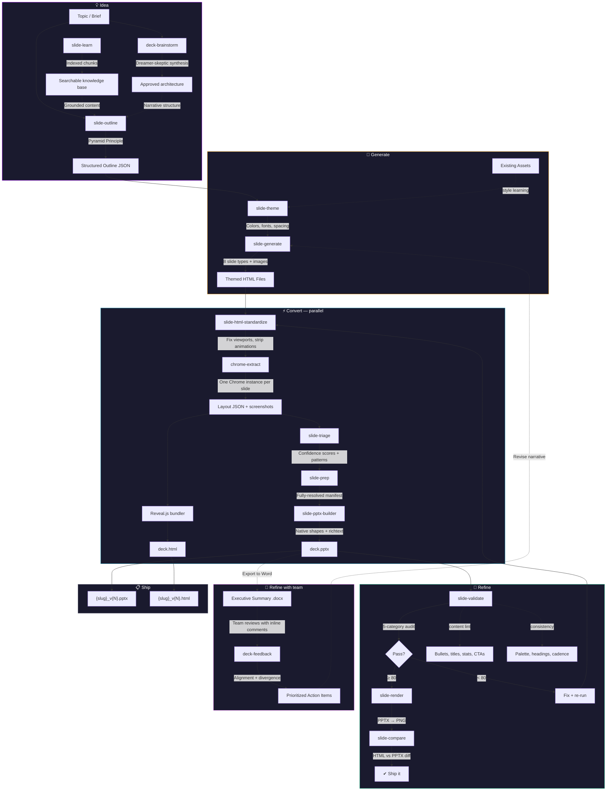

# Pipeline Architecture

How the workflow maps to skills, and how data flows between them.



## Idea

Get from a topic to a structured plan.

| Skill | What it does |
|---|---|
| **slide-learn** | Indexes source documents (PDF, PPTX, DOCX, HTML, images) into searchable markdown with YAML frontmatter. Two-pass: per-document extraction (parallelizable, uses vision for binaries) then cross-document synthesis (`_insights/`, `_tags/`, `_relationships/`). Hash-based incremental re-indexing. |
| **deck-brainstorm** | Dreamer-skeptic brainstorm with 3-team structure (narrative/operational/commercial). Generative persona framework with pass/fail criteria. 8 content principles (mechanism-before-outcome, two-layer proof, hallway line). Synthesis resolves conflicts into approved architecture. |
| **deck-pipeline** | Hub-and-spoke orchestrator for the full 8-phase workflow. Constraint injection, gate conditions, 10 default constraints from production sessions. Phase state persists across sessions. |
| **slide-outline** | Structures a topic into a Pyramid Principle narrative — setup, evidence, close. Produces outline JSON with slide types, titles as assertions, and speaker notes. |

## Generate

Turn the plan into slides.

| Skill | What it does |
|---|---|
| **slide-theme** | Brand identity as structured JSON — colors, fonts, spacing, layout tokens. Validates contrast ratios. Three built-in themes. Extracts styles from PPTX/PDF/images with confidence scores. Portable `.pptprofile` files for team sharing. |
| **slide-generate** | Transforms outline JSON into themed HTML slide files. 8 slide types: title, content, stats, comparison, quote, section divider, CTA, blank. Sources images from Unsplash or icon sets with attribution. |

## Convert

HTML to native PowerPoint.

| Skill | What it does |
|---|---|
| **slide-html-standardize** | Normalizes HTML for extraction — viewport meta, `.slide` wrapper, strips CSS animations and CDN dependencies. Annotates complexity (high/low) for pipeline routing. |
| **chrome-extract** | Chrome headless renders each slide and extracts computed bounding boxes, colors, fonts, and inline formatting as structured JSON. Runs in parallel — one Chrome instance per slide. |
| **slide-triage** | Scores each element (0.0–1.0 confidence) against 10 known-pattern signatures (SVG bleed, accent bars, rotation, card overflow, badge collision). Detects collision risks. Outputs findings JSON. |
| **slide-prep** | Auto-resolves high-confidence elements (>= 0.85) with geometry transforms. Flags low-confidence elements for model inspection. Produces manifest with `resolvedRect` coordinates — no ambiguity at build time. |
| **slide-pptx-builder** | Maps manifest to native python-pptx shapes — richtext boxes, embedded SVG screenshots. Alpha blending, card text clamping, coordinate mapping. Zero classification — the manifest is the contract. |
| **slide-html-to-pptx** | Orchestrates parallel extraction + sequential PPTX assembly. Caches screenshots for SVG cropping and fallback slides. |

## Refine

Check quality and iterate.

| Skill | What it does |
|---|---|
| **slide-validate** | 5-category deck audit (structure 25%, content 30%, layout 20%, consistency 15%, lint 10%). PASS ≥ 80, REVIEW 60–79, FAIL < 60. Catches bullet overload, title hygiene, stat formatting, passive voice, CTA completeness. Checks heading sizes, palette adherence, section cadence. |
| **slide-render** | Renders PPTX to PNG via LibreOffice headless. Generates contact-sheet montages for quick visual review. |
| **slide-compare** | Paired HTML/PPTX screenshots for side-by-side fidelity comparison. Catches visual regressions after conversion. |
| **slide-treatment-log** | Records per-slide fix history. Closes the feedback loop from visual comparison failures back to known-patterns.md. Identifies fix candidates for promotion to permanent patterns. |
| **deck-feedback** | Parses inline comments from Word (.docx) documents. Classifies sentiment, clusters by passage, detects alignment vs divergence. Generates prioritized action items as markdown, JSON, or Word report. |
| **deck-checkpoint** | Session synthesis — captures decisions, artifacts, and next steps. Preserves continuity across sessions. |

## Supporting

| Skill | What it does |
|---|---|
| **slide-pipeline** | End-to-end orchestrator. Three fidelity tiers (best/draft/rough) with multi-pass verification loops. Dual-format output (PPTX + Reveal.js HTML). Non-destructive versioning. Session-scoped edit coordination locks. |
| **slide-design** | Reference-only: design principles, quality rubric, CSS contract (zone naming, fallback layout), contextual hints + REVIEW flags. |
| **slide-config** | Two-tier configuration — user-level defaults (`~/.something-wicked/wicked-prezzie/config.json`) and project-level overrides (`skills/slide-config/config.json`). |

## Storage

```
~/.something-wicked/wicked-prezzie/     User-level (shared across projects)
  config.json                           Defaults: font, fidelity, API keys
  themes/                               Theme JSON files
  profiles/                             Exported .pptprofile files
  registry/                             Shared design asset cache
  versions/                             Deck version metadata
  index/                                Generated document indexes
    _manifest.json                      Index metadata and freshness
    _insights/                          Fast-path summaries (key-facts, themes, gaps)
    _tags/                              Content-type cross-references
    _relationships/                     Cross-document entity links

skills/slide-config/config.json         Project-level overrides
  quality_threshold, viewport, active_theme, slide dimensions
```
