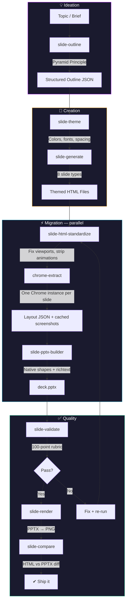

# Pipeline Architecture

## Stages

### Ideation

| Skill | Purpose |
|---|---|
| **slide-outline** | Structures a topic into a Pyramid Principle narrative — setup, evidence, close. Produces outline JSON with slide types, titles as assertions, and speaker notes. |

### Creation

| Skill | Purpose |
|---|---|
| **slide-theme** | Defines brand identity as structured JSON — colors, fonts, spacing, layout tokens. Validates contrast ratios and hierarchy. Three built-in themes. |
| **slide-generate** | Transforms outline JSON into individual themed HTML slide files. 8 slide types: title, content, stats, comparison, quote, section divider, CTA, blank. |

### Migration

| Skill | Purpose |
|---|---|
| **slide-html-standardize** | Normalizes HTML for Chrome extraction — adds viewport meta, wraps in `.slide` div, strips CSS animations and external CDN dependencies. |
| **chrome-extract** | Drives Chrome headless to render each slide and extract computed bounding boxes, colors, fonts, and inline formatting as structured JSON. Runs in parallel — one Chrome instance per slide. |
| **slide-pptx-builder** | Maps layout JSON to native python-pptx objects — shapes, richtext boxes, embedded SVG screenshots. Handles alpha blending, card text clamping, and coordinate mapping. |
| **slide-html-to-pptx** | Orchestrates parallel extraction + sequential PPTX assembly. Caches screenshots for SVG cropping and fallback slides. |

### Quality

| Skill | Purpose |
|---|---|
| **slide-validate** | Scores each slide on a 100-point rubric — bounds checking, text overflow estimation, visual overflow detection. Slides below 75 are flagged with specific issues. |
| **slide-render** | Renders PPTX to PNG via PowerPoint PDF export + pdftoppm. Generates contact-sheet montages for quick visual review. |
| **slide-compare** | Produces paired HTML/PPTX screenshots for side-by-side fidelity comparison. Catches visual regressions after conversion. |

### Supporting

| Skill | Purpose |
|---|---|
| **slide-design** | Reference-only skill with design principles and quality rubric. Consulted by other skills for typography, color, layout, and visual hierarchy rules. |
| **slide-config** | Project-level settings — quality threshold, viewport dimensions, hide selectors, default font. Persists in `config.json`. |
| **slide-pipeline** | End-to-end orchestrator that chains all stages. The default entry point for conversion requests. |
