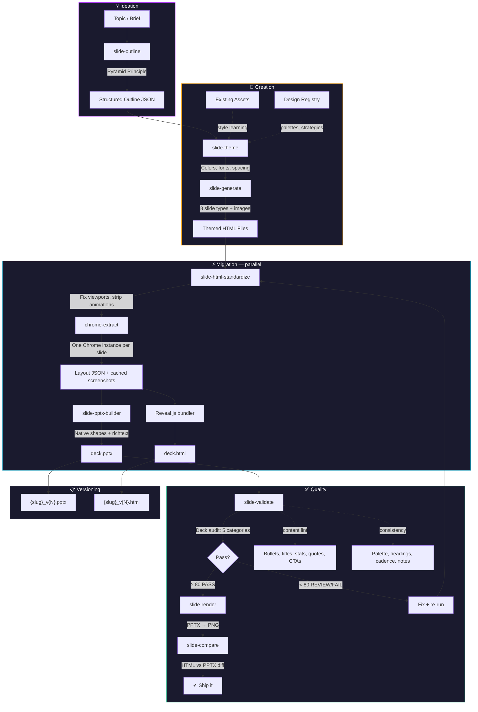

# Pipeline Architecture



## Stages

### Ideation

| Skill | Purpose |
|---|---|
| **slide-outline** | Structures a topic into a Pyramid Principle narrative — setup, evidence, close. Produces outline JSON with slide types, titles as assertions, and speaker notes. |

### Creation

| Skill | Purpose |
|---|---|
| **slide-theme** | Defines brand identity as structured JSON — colors, fonts, spacing, layout tokens. Validates contrast ratios and hierarchy. Three built-in themes. Extracts styles from existing PPTX/PDF/images. Manages portable profiles and a git-backed shared design registry. |
| **slide-generate** | Transforms outline JSON into individual themed HTML slide files. 8 slide types: title, content, stats, comparison, quote, section divider, CTA, blank. Sources images from Unsplash or icon sets with attribution. |

### Migration

| Skill | Purpose |
|---|---|
| **slide-html-standardize** | Normalizes HTML for Chrome extraction — adds viewport meta, wraps in `.slide` div, strips CSS animations and external CDN dependencies. |
| **chrome-extract** | Drives Chrome headless to render each slide and extract computed bounding boxes, colors, fonts, and inline formatting as structured JSON. Runs in parallel — one Chrome instance per slide. |
| **slide-pptx-builder** | Maps layout JSON to native python-pptx objects — shapes, richtext boxes, embedded SVG screenshots. Handles alpha blending, card text clamping, and coordinate mapping. |
| **slide-html-to-pptx** | Orchestrates parallel extraction + sequential PPTX assembly. Caches screenshots for SVG cropping and fallback slides. |

### Quality

| Skill | Purpose |
|---|---|
| **slide-validate** | 5-category deck audit (structure 25%, content 30%, layout 20%, consistency 15%, lint 10%). Content lint catches bullet overload, title hygiene, stat formatting, quote attribution, passive voice, CTA completeness. Consistency checks heading sizes, palette adherence, template distribution, section cadence, speaker notes. Layout checks bounds, overflow, and element overlap. Scoring: PASS ≥ 80, REVIEW 60–79, FAIL < 60. Supports re-audit with delta tracking. |
| **slide-render** | Renders PPTX to PNG via LibreOffice headless PDF export + pdftoppm. Generates contact-sheet montages for quick visual review. |
| **slide-compare** | Produces paired HTML/PPTX screenshots for side-by-side fidelity comparison. Catches visual regressions after conversion. |

### Supporting

| Skill | Purpose |
|---|---|
| **slide-design** | Reference-only skill with design principles, quality rubric, CSS contract (zone naming conventions and fallback layout), and contextual hints + REVIEW flagging system. |
| **slide-config** | Two-tier configuration — user-level (`~/.something-wicked/wicked-prezzie/config.json`) for defaults shared across projects, project-level (`skills/slide-config/config.json`) for per-project overrides. |
| **slide-pipeline** | End-to-end orchestrator. Three fidelity tiers (best/draft/rough) with multi-pass verification loops. Dual-format output (PPTX + Reveal.js HTML). Non-destructive versioning (`{slug}_v{N}.pptx`). Session-scoped edit coordination locks. |

## Storage

```
~/.something-wicked/wicked-prezzie/     User-level (shared across projects)
  config.json                           Defaults: font, fidelity, API keys
  themes/                               Theme JSON files
  profiles/                             Exported .pptprofile files
  registry/                             Shared design asset cache
  versions/                             Deck version metadata

skills/slide-config/config.json         Project-level overrides
  quality_threshold, viewport, active_theme, slide dimensions
```
