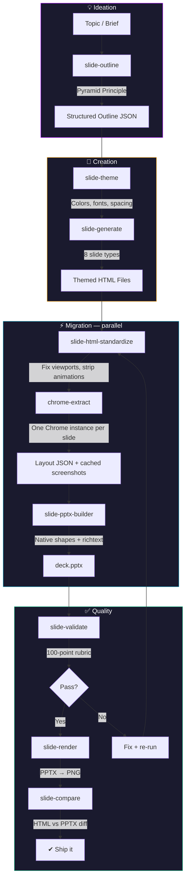

# wicked-prezzie

**From blank page to polished PowerPoint. Or from messy HTML to clean PPTX. Or anything in between.**

wicked-prezzie is a Claude Code plugin that handles the entire presentation lifecycle — brainstorm an idea, build a branded deck, convert existing HTML slides, validate the output, and iterate until it's right. Every slide produces *native, editable* PowerPoint with real shapes and formatted text. Not screenshots. Not images. The real thing.

---

## Three ways to use it

### 1. Ideation — start from nothing

Got a topic, a meeting, a vague idea? Just say what you need.

```
"I'm presenting to the board next week about our AI platform.
 15 minutes. They care about ROI and timeline. Help me plan it."
```

Claude structures your content using the **Pyramid Principle** — lead with the conclusion, group by argument, one message per slide. You get a narrative arc (setup → evidence → close) with speaker notes, not a pile of bullet points.

```
"Now generate the slides. Use our brand colors — navy and gold."
```

Themed HTML slides appear, ready for conversion. Each slide follows design principles: proper typography hierarchy, 30%+ whitespace, WCAG-compliant contrast, max 6-7 elements per slide.

### 2. Creation — build from content

Have bullet points, a doc, or talking points? Skip the blank page.

```
"Here are my Q4 results. Turn these into a deck."

"I have an outline.json — generate slides from it with the corporate-light theme."

"Create a stats slide with these three metrics: revenue $4.2M, growth 23%, retention 91%."
```

Eight slide types out of the box: **title, content, stats, comparison, quote, section divider, CTA, blank.** Each one follows the active theme's colors, fonts, and spacing.

### 3. Migration — convert existing HTML

Already have slides from ChatGPT, Claude, Gemini, reveal.js, or your own tooling? Bring them.

```
"Convert the HTML slides in my-deck/ to PowerPoint."
```

The pipeline handles the ugly parts automatically:
- **Standardize** — fix viewports, add `.slide` wrappers, strip animations and CDN dependencies
- **Extract** — Chrome headless captures every element's computed position, color, and formatting
- **Build** — layout JSON maps to native PPTX shapes, richtext, and embedded SVG images
- **Validate** — 100-point quality rubric catches overflow, bounds errors, empty slides
- **Render** — PPTX to PNG via PowerPoint for visual review
- **Compare** — side-by-side HTML vs PPTX fidelity check

Slides extract in **parallel** — one Chrome instance per slide, all concurrent. A 10-slide deck that took 30 seconds now takes ~8.

---

## What makes it different

**Native shapes, not screenshots.** Most HTML-to-PPTX tools paste an image and call it done. wicked-prezzie extracts every heading, paragraph, card, and container as a real PowerPoint object. Your boss can select the title and change it. As intended.

**Parallel extraction.** Each slide gets its own Chrome headless process running concurrently. Screenshots are cached once — reused for SVG cropping and fallback slides. No duplicate Chrome launches.

**Quality gate built in.** Every slide is scored against a 100-point rubric. The validator tells you *which* slides have problems and *what's wrong* — bounds overflow, text clipping, empty content. Fix and re-run.

**Always builds.** Bad HTML? Chrome crash? Malformed CSS? The fallback drops a full-page screenshot onto the slide. You get a deck every time, even if some slides need manual attention.

**Brand-aware.** Themes aren't cosmetic — they drive the entire generation pipeline. Colors, fonts, spacing, contrast ratios. Three built-in themes, or create your own from hex codes, a logo, or a website.

---

## Install

```bash
git clone https://github.com/mikeparcewski/wicked-prezzie.git
cd wicked-prezzie
claude
```

Claude discovers all 13 skills automatically. Then talk to it:

- *"Make me a presentation about Q1 results"*
- *"I have bullet points — turn them into slides"*
- *"Convert the HTML in slides/ to PowerPoint"*
- *"Use our brand: primary #2563EB, accent #F59E0B, dark bg"*
- *"The headings are wrapping weird in the PPTX"*
- *"Check my deck for layout issues"*
- *"Does the PowerPoint match the original HTML?"*
- *"Show me what the slides look like"*
- *"Lower the quality threshold to 70 for this project"*

---

## The full pipeline



> Every box is an independent skill. Jump in at any stage — bring your own HTML, start from an outline, or go from blank page to polished deck.

---

## Themes

Three built-in. Create your own. Or let Claude extract one from your brand.

| Theme | Vibe |
|---|---|
| **midnight-purple** | Dark `#0A0A0F` + purple `#A100FF` + amber accent |
| **corporate-light** | Clean white + navy `#1E3A5F` + teal |
| **warm-dark** | Charcoal `#1A1A2E` + coral `#FF6B6B` + gold |

```bash
python skills/slide-theme/scripts/slide_theme.py create my-brand
python skills/slide-theme/scripts/slide_theme.py activate my-brand
```

Themes validate automatically — contrast ratios, palette size, font limits, size hierarchy.

---

## Quality gate

Every slide is scored out of 100:

| Issue | Deduction |
|---|---|
| Shape bleeds past slide edge | -10 |
| Visual overflow (pixel check) | -10 |
| Empty slide | -15 |
| Text overflow estimate | -3 |

Below 75? Flagged with specific issues and fix guidance.

```bash
# Fast static check
python skills/slide-validate/scripts/slide_validate.py deck.pptx

# Pixel-level overflow detection (renders through PowerPoint)
python skills/slide-validate/scripts/slide_validate.py deck.pptx --render
```

---

## Pipeline options

```bash
python skills/slide-pipeline/scripts/slide_pipeline.py \
  --input-dir ./slides \
  --output deck.pptx \
  --viewport 1920x1080 \          # Default: 1280x720
  --hide ".nav,.footer" \          # CSS selectors to hide
  --workers 8 \                    # Parallel Chrome instances
  --no-standardize \               # HTML already clean
  --no-validate \                  # Skip quality scoring
  --no-render \                    # Skip PNG output
  --no-compare \                   # Skip fidelity check
  --visual-overflow \              # Pixel-level overflow detection
  --montage montage.png \          # Contact sheet of all slides
  --slides slide-01.html,slide-03.html  # Just these ones
```

---

## Prerequisites

```bash
pip install python-pptx beautifulsoup4 lxml Pillow
brew install poppler    # pdftoppm for PDF->PNG
```

Plus:
- **Google Chrome** — headless layout extraction
- **Microsoft PowerPoint** — the definitive renderer (AppleScript on macOS, COM on Windows)

---

## Project layout

```
wicked-prezzie/
  .claude-plugin/              Plugin manifest
  skills/
    slide-theme/               Brand palettes + fonts
    slide-outline/             Pyramid Principle outlines
    slide-generate/            Outline → themed HTML
    slide-html-standardize/    Clean up AI-generated HTML
    chrome-extract/            Chrome headless → layout JSON
    slide-pptx-builder/        Layout JSON → native PPTX
    slide-html-to-pptx/        Parallel batch conversion
    slide-validate/            Quality scoring + overflow detection
    slide-render/              PPTX → PNG rendering
    slide-compare/             HTML vs PPTX visual diff
    slide-design/              Design principles (reference)
    slide-pipeline/            End-to-end orchestrator
    slide-config/              Project settings
  tests/                       Fixtures + trigger evals
```

---

## Known tradeoffs

These are deliberate:

- **Gradients** become solid blended colors (PPTX gradient support is limited)
- **Animations** are stripped (we capture the final state, not the journey)
- **Font metrics** differ between CSS and Calibri (compensated with width multipliers, not perfect)
- **Small SVGs** under 60px are skipped (decorative noise that captures surrounding text)
- **Chrome + PowerPoint required** locally (no substitute for the definitive renderers)

---

## License

MIT. Do whatever you want with it.
